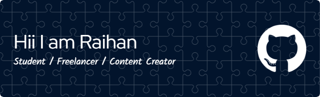

## Hi I'm Raihan Ramona Putra👋 

🚀 Saya seorang Frontend Developer yang suka membangun website modern, bersih, dan responsif. Saat ini saya sedang menempuh studi Teknik Informatika (S1) dan terus mengasah kemampuan di React.js, Tailwind CSS, dan desain UI modern. 

## Skills

## 📊 GitHub Stats  

  

  

<!--  -->

<!--
**raihanramonaputra/raihanramonaputra** is a ✨ _special_ ✨ repository because its `README.md` (this file) appears on your GitHub profile.

Here are some ideas to get you started:

- 🔭 I’m currently working on ...
- 🌱 I’m currently learning ...
- 👯 I’m looking to collaborate on ...
- 🤔 I’m looking for help with ...
- 💬 Ask me about ...
- 📫 How to reach me: ...
- 😄 Pronouns: ...
- ⚡ Fun fact: ...
-->

## Skills

>>>>>>> 0c6af4112d82c39b1e899b63ccbf8cf74b3a57c1

<!-- ## Contact

## Suka suka -->

